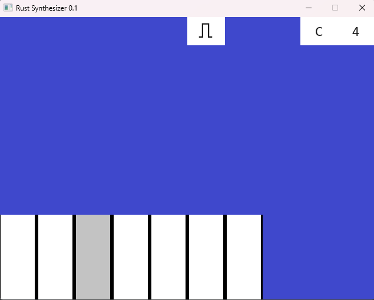

# Rust Synthesizer


## Requirements

* x86-64
* Linux/Unix
* [Rust](https://www.rust-lang.org/tools/install)

## Cargo dependencies
* rodio = "0.17.1"
* console = "0.15.7"
* rand = "0.8"

## Start

The script "up" builds and runs our application by executing the following:
```
1. cargo build
2. cargo run
```

## Usage


You can interact with the synthesizer using the following keys:

    Q, W, E, R, T, Y, U: Play musical notes A, B, C, D, E, F, G respectively.
    F1: Decrease the octave.
    F2: Increase the octave.
    F: Change the synthesizer waveform (sine, square, saw).